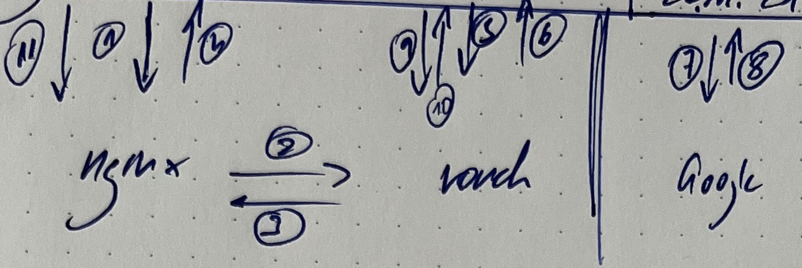
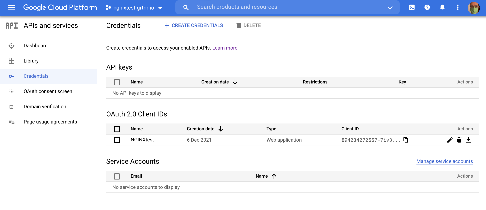
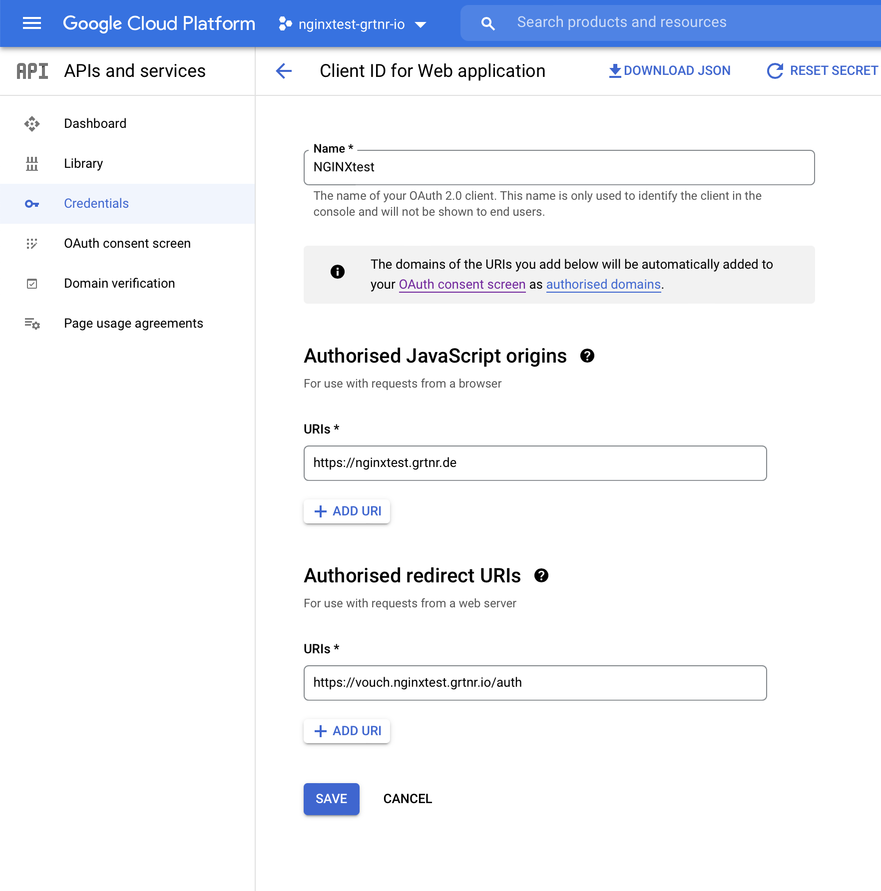

# nginx_with_logins

A demo setup for having restricted access to web-sites or specific paths within a website based on nginx. `docker-composed` based and deployed via Ansible.

The behavior we want to achieve:
* Documents camn be public, in our case: https://nginxtest.grtnr.io
* Documents can be _secret_, i.e. only accessible after having logged in with google (any google account will do): https://nginxtest.grtnr.io/secret/ 
## Overall setup

The login flow is as folllows:

That's what happens during the login:

1. User sends request w/o being logged in to https://grtnr.io/secret
2. nginx checks the credentials by forwarding it to vouch: By routing it to /validate that corresponds to http://vouch:9090/validate (within the docker-compose network)
3. Vouch inspects the headers and returns `401 Unauthorized`
4. For nginx this is an error and it forwards the brwoser to the error page: `https://vouch.grtnr.io/login?url=$scheme://$http_host$request_uri&vouch-failcount=$auth_resp_failcount&X-Vouch-Token=$auth_resp_jwt&error=$auth_resp_err`
5. The browser sends a request to this URL of vouch
6. Vouch responds with a `302 Found` and redirects the browser to Google Login.
7. Browser goes to Google and logs in.
8. Google login redirects the browser to the reurn address: https://vouch.ngingtest.grtnr.io/auth
9. Browser sends request to the vouch URL
10. Vouch redirects browser to nginx: https://grtnr.io/secret
11. Browser send request to https://grtnr.io/secret, this time with a JWT
## Google settings

## Reading

* An example of a vouch configuration with white listing emnail addresses [is here](https://github.com/vouch/vouch-proxy/blob/master/config/config.yml_example).
* A good and thorough explanation of how nginx and Letsencrypt interact within a docker setup: [How to set up an easy and secure reverse proxy with Docker, Nginx & Letsencrypt](https://medium.com/free-code-camp/docker-nginx-letsencrypt-easy-secure-reverse-proxy-40165ba3aee2)
* May be I want to use [Statping](https://github.com/statping/statping)
* A complete guide: [Add Google Authentication to any Website using Nginx and Oauth Proxy](https://dev.to/ahmedmusaad/add-google-authentication-to-any-website-using-nginx-and-oauth-proxy-259l)
* This articale also explains how JS Code can run within Nginx: [Validating OAuth 2.0 Access Tokens with NGINX and NGINX Plus](https://www.nginx.com/blog/validating-oauth-2-0-access-tokens-nginx/#production-configuration)
* Another alternative to OAuth2 Proxy: [Vouch](https://github.com/vouch/vouch-proxy)
* Two explanations on how to use Vouch: [Use nginx to Add Authentication to Any Application](https://developer.okta.com/blog/2018/08/28/nginx-auth-request) and [Enforce Google Authentication for Any Application with nginx and Vouch Proxy](https://medium.com/lasso/use-nginx-and-lasso-to-add-google-authentication-to-any-application-d3a8a7f073dd)
* The docker image I plan to use is from [Bitnami](https://hub.docker.com/r/bitnami/oauth2-proxy/)
